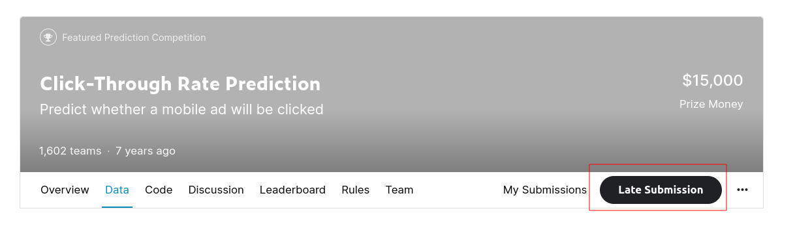

# Adverity Challenge: CTR Outlier Visualization

Outlier detection on the Kaggle [Click-Through Rate Prediction](https://www.kaggle.com/c/avazu-ctr-prediction/) data.

## Installation

### Virtual Environment

1. Set up a virtual environment with your favorite environment manager, e.g.:

    ```python
    python -m venv adverity-challenge
    ```

1. Install packges:

    ```python
    pip install -r requirements.txt
    ```

### Kaggle dataset

1. Authenticate the Kaggle client: [Instructions](https://www.kaggle.com/docs/api#authentication)
1. Accept competition rules at [its page](https://www.kaggle.com/c/avazu-ctr-prediction/), by clicking on **Late Submission**:
    
1. Download the dataset to the `data` folder:

    ```shell
    kaggle competitions download -c avazu-ctr-prediction -p data
    ```

## Running the Visualization

The results are in `outlier_detection.ipynb`. You can open it with the following command:

```shell
jupyter notebook outlier_detection.ipynb
```
